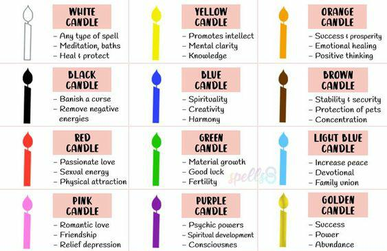
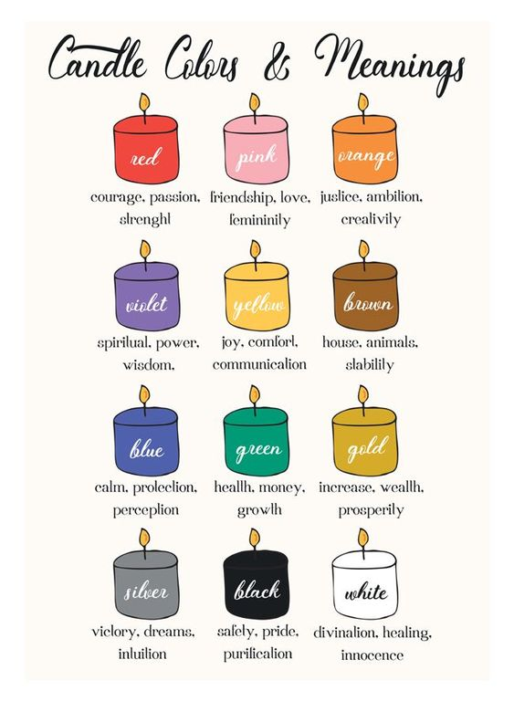
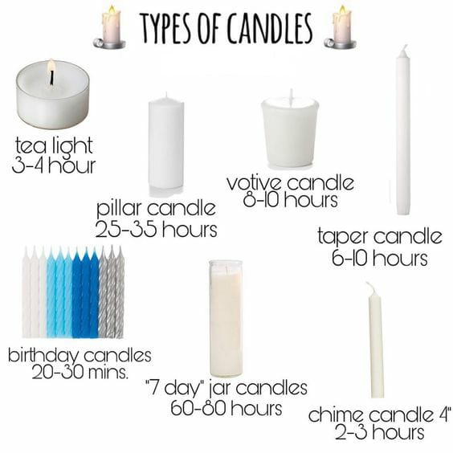

## Day 19

[Angel Time](https://youtu.be/N7xr2BKt9fY)

What Are Angel Colors?
When it comes to color there is much more than meets the eye. Every color holds an energy, and carries a vibration, 
and so by working with colors which are in alignment with the areas of angelic help you would like to receive… 
You can align yourself with the energy of the angels who can most support you by working with the specific angel colors.

एन्जिल रंग क्या हैं?
जब यह रंग में आता है तो आंख से मिलता है। हर रंग एक ऊर्जा रखता है, और एक कंपन करता है, और इसलिए उन रंगों के साथ काम करके जो कि एंगेलिक के क्षेत्रों के साथ संरेखित होते हैं जिन्हें आप प्राप्त करना चाहते हैं 
... आप अपने आप को उन स्वर्गदूतों की ऊर्जा के साथ संरेखित कर सकते हैं जो काम करके आपका सबसे अधिक समर्थन कर सकते हैं विशिष्ट देवदूत रंगों के साथ।

13 Angel Colors!

Angel Colors and their corresponding qualities… These colors are each vibrationally aligned with specific areas of focus in which your angels can assist.
White
Purity, unity, honesty, and sincerity. Healing, peaceful, and completion. White light, and angels of white light, protect and purify the mind, body, and spirit. White is often considered to be the absence of color… Within this void is a direct path to your angels and a link to the Divine.
Gold
Abundance, knowledge and an enlightened mind. Charm, certainty, and charisma. The color gold will help you tap into the ancient knowledge of your soul, and the angels who can help you gain access.
Silver
Blessings, intuition and the Divine Feminine. The color silver offers a gentle neutrality, which opens the door for you to journey within, to ponder the deeper meaning of life, and to reflect upon what has been, and upon all that is.
Black
Mystery, discovery, protection, and change. Black represents the cycle of death and rebirth, and the infinite possibilities for positive change held therein.
Brown/ Tan
Groundedness, neutral, structure, stability, and connection to Earth.
Red
Power, strength, and vitality. Red represents passion, survival, sexual energy, and movement. The color red is closely tied with the element of fire, and can stimulate fast change, expansion, activity.
Orange
Creativity, happiness, and attraction. Orange stimulates vitality, encouragement, and adaptability while encouraging optimism, connection, and vitality.
Yellow
Joy, spirituality, and cheerfulness. Yellow evokes optimism, and stimulates the intellect. Yellow is closely connected with spiritual energies, and will help to align you with the full extent of your inner wisdom.
Green
Fertility, growth, luck and finance. Green will help you to rest, relax, and restore your energy. Working with green evokes the energy of wellbeing, and of unconditional love.
Blue
Patience, health, harmony and tranquility. Blue will help you to speak and to know the truth, to clearly communicate, and to understand and express your will.
Indigo
Clear vision within the inner and outer realms. Insight, intuition, and understanding within the astral and spiritual realms.
Violet
Spiritual fulfillment, good judgement and inspired ambition. The violet vibration is dreamy, imaginative, and inspiring… Violet will help you concentrate, make progress, transmute negativity, and align with high vibrational, magical, guides and angels.
Pink
Love, compassion, and nurturing. Pink carries the vibration of innocence, honor, and motherly love. Pink can help you to see life through rose-colored lenses… From the perspective of the angels, which is unconditi

13 एन्जिल रंग!

एन्जिल रंग और उनके इसी गुण… ये रंग प्रत्येक विशिष्ट रूप से फोकस के विशिष्ट क्षेत्रों के साथ गठबंधन किए जाते हैं जिसमें आपके स्वर्गदूत सहायता कर सकते हैं।
सफेद
पवित्रता, एकता, ईमानदारी, और ईमानदारी। हीलिंग, शांतिपूर्ण और पूर्णता। सफेद प्रकाश, और सफेद प्रकाश के स्वर्गदूत, मन, शरीर और आत्मा की रक्षा और शुद्धिकरण करते हैं। सफेद रंग को अक्सर रंग की अनुपस्थिति माना जाता है ... इस शून्य के भीतर अपने स्वर्गदूतों के लिए एक सीधा रास्ता है और दिव्य के लिए एक कड़ी है।
सोना
प्रचुरता, ज्ञान और एक प्रबुद्ध मन। आकर्षण, निश्चितता और करिश्मा। रंग सोना आपको अपनी आत्मा के प्राचीन ज्ञान में टैप करने में मदद करेगा, और देवदूत जो आपको पहुंच प्राप्त करने में मदद कर सकते हैं।
चांदी
आशीर्वाद, अंतर्ज्ञान और दैवीय स्त्री। रंग चांदी एक सौम्य तटस्थता प्रदान करता है, जो आपके भीतर यात्रा करने के लिए, जीवन के गहरे अर्थ को इंगित करने के लिए, और जो कुछ रहा है, और उस पर सभी को प्रतिबिंबित करने के लिए दरवाजा खोलता है।
काली
रहस्य, खोज, सुरक्षा और परिवर्तन। ब्लैक मृत्यु और पुनर्जन्म के चक्र का प्रतिनिधित्व करता है, और उसमें होने वाले सकारात्मक बदलाव की अनंत संभावनाएँ।
भूरा / तन
जमीन, तटस्थता, संरचना, स्थिरता और पृथ्वी से संबंध।
लाल
शक्ति, शक्ति, और जीवन शक्ति। लाल जुनून, अस्तित्व, यौन ऊर्जा और आंदोलन का प्रतिनिधित्व करता है। रंग लाल आग के तत्व के साथ निकटता से जुड़ा हुआ है, और तेजी से परिवर्तन, विस्तार, गतिविधि को उत्तेजित कर सकता है।
संतरा
रचनात्मकता, खुशी और आकर्षण। ऑरेंज आशावाद, कनेक्शन और जीवन शक्ति को प्रोत्साहित करते हुए जीवन शक्ति, प्रोत्साहन और अनुकूलनशीलता को उत्तेजित करता है।
पीला
खुशी, आध्यात्मिकता और खुशमिजाजी। पीला आशावाद को उत्तेजित करता है, और बुद्धि को उत्तेजित करता है। पीला आध्यात्मिक ऊर्जाओं के साथ निकटता से जुड़ा हुआ है, और आपको अपने आंतरिक ज्ञान की पूरी सीमा के साथ संरेखित करने में मदद करेगा।
हरा
प्रजनन क्षमता, वृद्धि, भाग्य और वित्त। ग्रीन आपको अपनी ऊर्जा को आराम, आराम और बहाल करने में मदद करेगा। हरे रंग के साथ काम करना भलाई की ऊर्जा, और बिना शर्त प्यार करता है।
नीला
धैर्य, स्वास्थ्य, सद्भाव और शांति। नीला आपको बोलने और सच्चाई जानने, स्पष्ट रूप से संवाद करने और अपनी इच्छा को समझने और व्यक्त करने में मदद करेगा।
नील
आंतरिक और बाहरी स्थानों के भीतर स्पष्ट दृष्टि। सूक्ष्म और आध्यात्मिक क्षेत्र के भीतर अंतर्दृष्टि, अंतर्ज्ञान और समझ।
बैंगनी
आध्यात्मिक पूर्ति, अच्छा निर्णय और प्रेरित महत्वाकांक्षा। वायलेट कंपन स्वप्निल, कल्पनाशील और प्रेरक होता है ... वायलेट आपको ध्यान केंद्रित करने, प्रगति करने, नकारात्मकता को प्रसारित करने और उच्च कंपन, जादुई, गाइड और स्वर्गदूतों के साथ संरेखित करने में मदद करेगा।
गुलाबी
प्यार, करुणा और पोषण। गुलाबी मासूमियत, सम्मान, और ममता के कंपन को वहन करती है। गुलाबी रंग के लेंस के माध्यम से जीवन को देखने के लिए गुलाबी आपकी मदद कर सकता है ... स्वर्गदूतों के दृष्टिकोण से, जो बिना शर्त है

